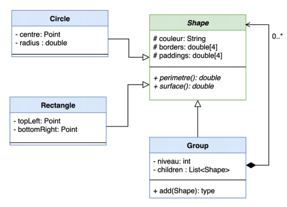
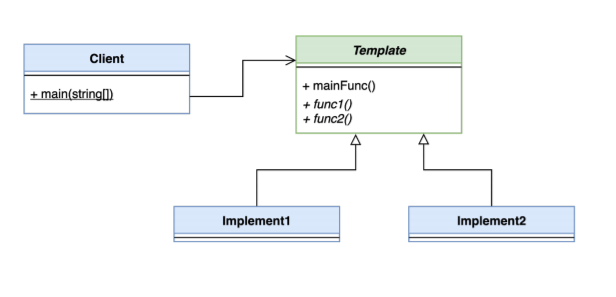
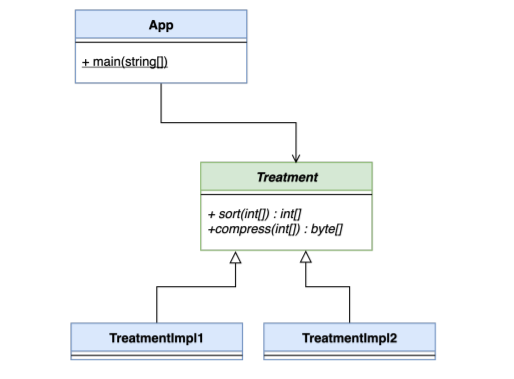
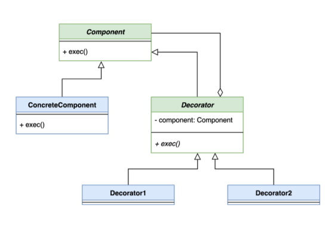
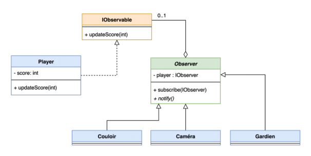

## Solution

### Question 1 : Design Pattern Composite

### Question 2 : Design Pattern Template

### Question 3 : Design Pattern Strategy

### Question 4 : Design Pattern Decorator

### Question 5 : Design Pattern Observer

