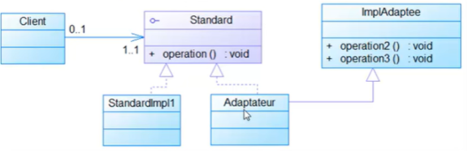
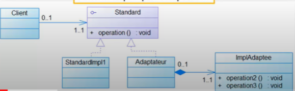

## INTRODUCTION
En développement logiciel, un patron de conception | design pattern | est un arrangement caractéristique de modules, reconnu comme bonne pratique en réponse à un problème de conception d'un logiciel. Il décrit une solution standard, utilisable dans la conception de différents logiciels.Pour ce récent rapport je vais traiter le pattern Adapter, tout en mentionnant sa définition, objectifs ainsi que sa conception, puis je vais l'implémenter en utilisant un exemple..
## C’est Quoi Un Design Pattern Adapter?
Un design pattern Adapter, il permet de convertir l’interface d’une classe dans une autre interface comprise par la partie cliente. Il permet à des classes de fonctionner ensemble, ce qui n’aurait pas ete possible a cause de leurs interfaces incompatibles
## Conception Generale 
### Conception Du Design Pattern Adapter - Heritage

### Conception Du Design Pattern Adapter - Composition

