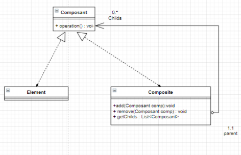

## INTRODUCTION
En développement logiciel, un patron de conception | design pattern | est un arrangement caractéristique de modules, reconnu comme bonne pratique en réponse à un problème de conception d'un logiciel. Il décrit une solution standard, utilisable dans la conception de différents logiciels.Pour ce récent rapport je vais traiter le pattern Composite, tout en mentionnant sa définition, objectifs ainsi que sa conception, puis je vais l'implémenter en utilisant un exemple..
## C’est Quoi Un Design Pattern Composite?
Un design pattern Composite permet d’organiser les objets en structure arborescente afin de représenter une hiérarchie. Il permet à la partie cliente de manipuler un Objet unique et un Objet composé de la même manière.

##Conception Generale
- **Composante**: Définit l’interface d’un Objet pouvant être un composant d’un autre objet de l’arborescence.
- **Élément**: implémente un Objet de l’arborescence n’ayant pas d’objet le composant.
- **Composite**: Implémente un Objet de l’arborescence ayant un ou des Objets de composant
La Partie Cliente manipule les objet par l’interface **Composant**.

