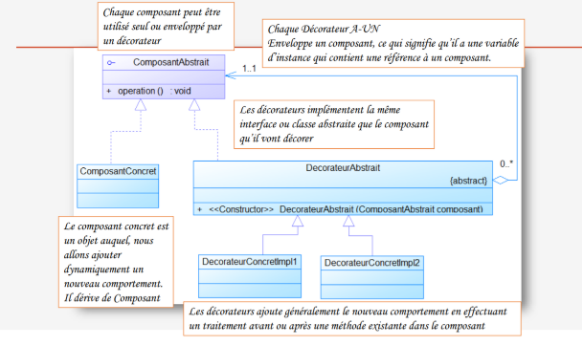

## INTRODUCTION

En développement logiciel, un patron de conception | design pattern | est un arrangement caractéristique de modules, reconnu comme bonne pratique en réponse à un problème de conception d'un logiciel. Il décrit une solution standard, utilisable dans la conception de différents logiciels.Pour ce récent rapport je vais traiter le pattern Decorator, tout en mentionnant sa définition, objectifs ainsi que sa conception, puis je vais l'implémenter en utilisant un exemple..

## C’est Quoi Un Design Pattern Decorator ?

En génie logiciel, le pattern Decorator  attache dynamiquement des **responsabilités** supplémentaires a un Objet.Il fournit une alternative souple a la dérivation pour étendre les fonctionnalités.
- **ComposantAbstrait** : Définit l'interface ou une classe abstraite qui représente le composant abstrait à décorer. 
- **ComposantConcret** : Implémentation de l’interface qui représente le composant concret à décorer et qui correspondant aux fonctionnalités souhaitées à la base. 
- **DecorateurAbstrait** : Interface ou classe abstraite qui définit le décorateur abstrait et contient une référence vers un objet Abstraction. 
- **DecorateurConcretImpl1** & **DecorateurConcretImpl2** : Représentent les décorateurs concrets des composants ,Les décorateurs ont un constructeur acceptant un objet Composant Abstrait, Les méthodes des décorateurs appellent la même méthode de l'objet qui a été passée au constructeur. 

La décoration ajoute des responsabilités en effectuant des opérations avant et/ou après cet appel.

##Conception Generale

