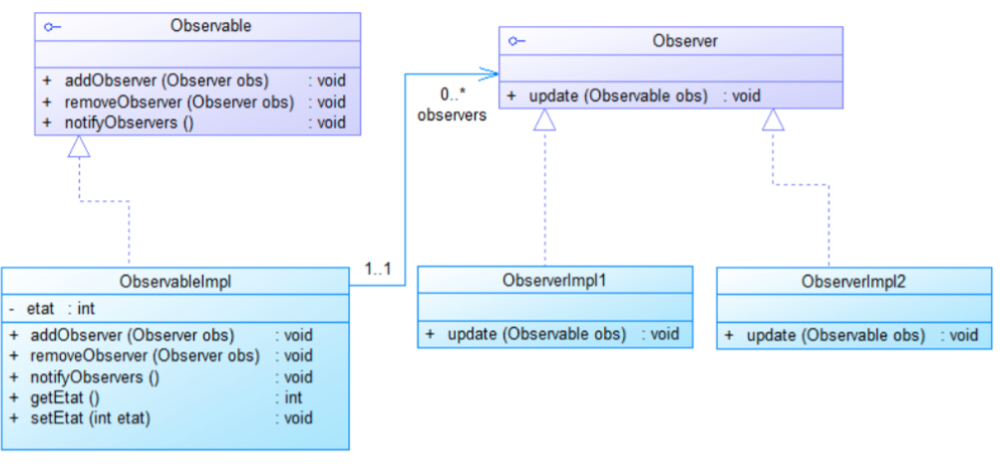

## INTRODUCTION
En développement logiciel, un patron de conception | design pattern | est un arrangement caractéristique de modules, reconnu comme bonne pratique en réponse à un problème de conception d'un logiciel. Il décrit une solution standard, utilisable dans la conception de différents logiciels.Pour ce récent rapport je vais traiter le pattern Observer, tout en mentionnant sa définition, objectifs ainsi que sa conception, puis je vais l'implémenter en utilisant un exemple..
## C’est Quoi Un Design Pattern Observer ?
En génie logiciel, le patron observateur  définit une relation entre les objets de type un à plusieurs, de façon que,lorsqu’un objet change d'état, tout ce qui en dépend en soient informés et soient mis à jour automatiquement.
## CONCEPTION GENERALE
Le diagramme UML du pattern Observateur définit deux interfaces et deux classes. 
**L’interface Observateur** sera implémenté par toutes classes qui souhaitent avoir le rôle d’observateur.
C’est le cas de la classe **ObservateurConcret** qui implémente la méthode **update(Observable)**. Cette méthode sera appelée automatiquement lors d’un changement d’état de la classe observée.
On trouve également **une interface Observable** qui devra être implémentée par les classes désireuses de posséder des observateurs.
La classe **ObservableConcret** implémente cette interface, ce qui lui permet de tenir informer ses observateurs. Celle-ci possède en attribut un état (ou plusieurs) et un tableau d’observateurs. L’état est un attribut dont les observateurs désirent suivre l’évolution de ses valeurs. Le tableau d’observateurs correspond à la liste des observateurs qui sont à l’écoute. 
En effet, il ne suffit pas à une classe d’implémenter l’interface Observateur pour être à l’écoute, il faut qu’elle s’abonne à un Observable via la méthode **ajouterObservateur(Observateur)**.

