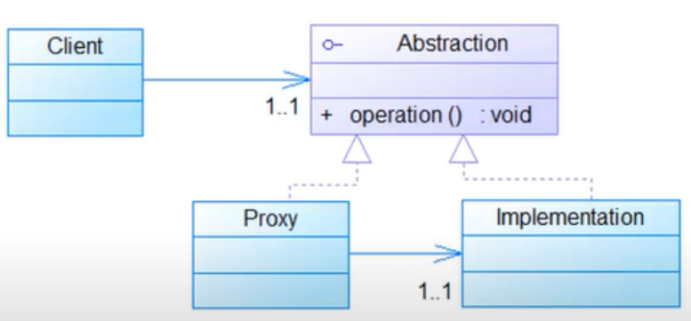

## INTRODUCTION
En développement logiciel, un patron de conception | design pattern | est un arrangement caractéristique de modules, reconnu comme bonne pratique en réponse à un problème de conception d'un logiciel. Il décrit une solution standard, utilisable dans la conception de différents logiciels.Pour ce récent rapport je vais traiter le pattern Proxy, tout en mentionnant sa définition, objectifs ainsi que sa conception, puis je vais l'implémenter en utilisant un exemple..
## C’est Quoi Un Design Pattern Proxy?
Un design pattern Proxy, il permet de fournir un intermédiaire entre la partie cliente et un objet pour contrôler les accès à ce dernier.Donc il permet d’isoler le comportement lors de l'accès à un objet.
## CONCEPTION
**Abstraction:** definit l’interface des classes implementation et Proxy.
**Implementation:** implement l’interface. Cette classe définit l’objet que l’objet Proxy représente.
**Proxy:** fournit un intermédiaire entre la partie cliente et l’objet implementation. Cet intermédiaire peut avoir plusieurs buts.
**La Partie cliente** appelle la méthode opération() de l’objet Proxy.

