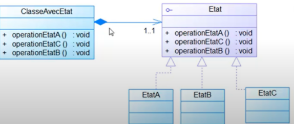
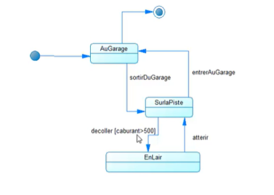

## INTRODUCTION
En développement logiciel, un patron de conception | design pattern | est un arrangement caractéristique de modules, reconnu comme bonne pratique en réponse à un problème de conception d'un logiciel. Il décrit une solution standard, utilisable dans la conception de différents logiciels.Pour ce récent rapport je vais traiter le pattern State, tout en mentionnant sa définition, objectifs ainsi que sa conception, puis je vais l'implémenter en utilisant un exemple..
## C’est Quoi Un Design Pattern State?
Un design pattern Proxy, il permet de changer le comportement d’un objet selon son état interne. Donc plus généralement il permet d’isoler les algorithmes propres à chaque etat d’un Objet.
## Conception Generale
- **ClasseAvecEtat:** est une classe avec État. Son comportement change en fonction de son état. La partie changeante de son comportement est déléguée à un objet Etat.
- **Etat:** définit l’interface d’un comportement d’un Etat.
- **EtatA, EtatB, EtatC:** sont les sous-classes concrètes de l’interface Etat. Elles implémentent des méthodes qui sont associées à un Etat.

### Diagramme De Classe

### Diagramme De Transition

