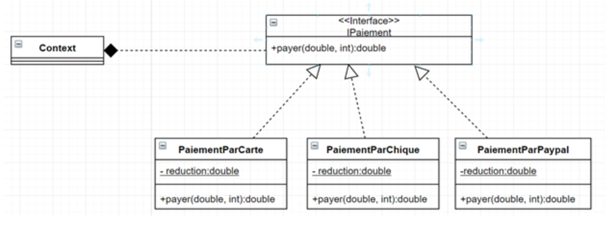

## INTRODUCTION
En développement logiciel, un patron de conception | design pattern | est un arrangement caractéristique de modules, reconnu comme bonne pratique en réponse à un problème de conception d'un logiciel. Il décrit une solution standard, utilisable dans la conception de différents logiciels.Pour ce récent rapport je vais traiter le pattern strategy, tout en mentionnant sa définition, objectifs ainsi que sa conception, puis je vais l'implémenter en utilisant un exemple..
## C’est Quoi Un Design Pattern Strategy?
En génie logiciel, le patron stratégie est un patron de conception de type comportemental grâce auquel des algorithmes peuvent être sélectionnés à la volée au cours du temps d'exécution selon certaines conditions.
Le patron de conception stratégie est utile pour des situations où il est nécessaire de permuter dynamiquement les algorithmes utilisés dans une application. 
Le patron stratégie est prévu pour fournir le moyen de définir **une famille d'algorithmes**, **encapsuler chacun** d'eux en tant qu'objet, et les rendre **interchangeables**. Ce patron laisse **les algorithmes changer indépendamment des clients** qui les emploient.
- **Famille d'algorithmes :** Algorithmes qui font la même chose mais d’une manière différente, a titre d’exemple on peut citer la famille des algorithmes de tri.
- **Encapsuler chaque algorithme:** chaque algorithme se trouve dans une classe et ces algos implémentent une interface commune. 
- **Rendre interchangeables :** Le couplage faible, la liaison de l’app cliente est liée avec une interface, cardinalité 1.
## Conception Generale

