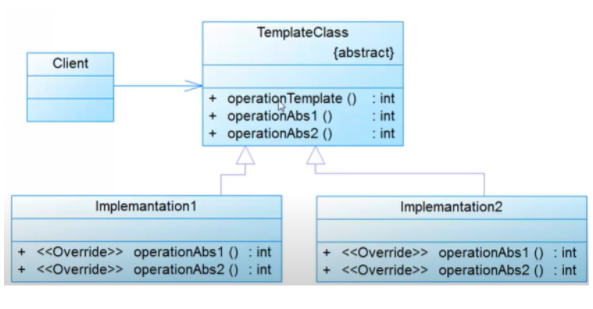

## INTRODUCTION
En développement logiciel, un patron de conception | design pattern | est un arrangement caractéristique de modules, reconnu comme bonne pratique en réponse à un problème de conception d'un logiciel. Il décrit une solution standard, utilisable dans la conception de différents logiciels.Pour ce récent rapport je vais traiter le pattern Template Method, tout en mentionnant sa définition, objectifs ainsi que sa conception, puis je vais l'implémenter en utilisant un exemple..
## C’est Quoi Un Design Pattern Template Méthode ?
Un design pattern Template Méthode permet d’isoler les parties variables d’un algorithme, il semble similaire avec le design pattern Strategy mais par compte ils sont différents au niveau du nombre de méthodes implémentées dans la classe template.
Généralement on utilise ce design pattern pour définir le squelette d’un algorithme en déléguant certaines étapes à des sous classes.
##CONCEPTION

